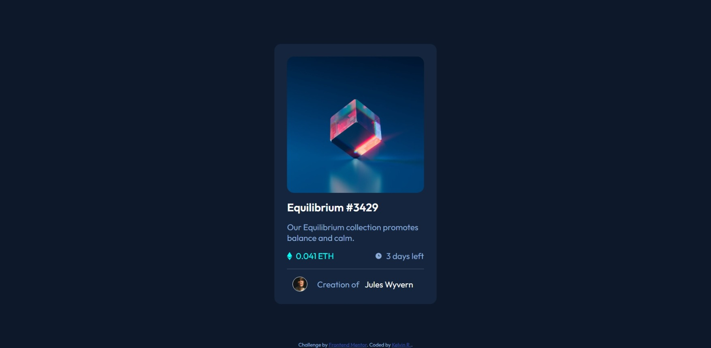

# Frontend Mentor - NFT preview card component solution

This is a solution to the [NFT preview card component challenge on Frontend Mentor](https://www.frontendmentor.io/challenges/nft-preview-card-component-SbdUL_w0U). Frontend Mentor challenges help you improve your coding skills by building realistic projects. 

## 📋 Table of contents

- [Overview](#overview)
  - [The challenge](#the-challenge)
  - [Screenshot](#screenshot)
  - [Links](#links)
- [My process](#my-process)
  - [Built with](#built-with)
- [Author](#author)

## Overview

### The challenge

Users should be able to:

- View the optimal layout depending on their device's screen size
- See hover states for interactive elements

### 📷 Screenshot

### 🔗 Links

- Live Site URL: [Click here to access the website](https://nivlekrod.github.io/nft-preview-card-html_css/)

## 🛠️ My process

### Built with

- Semantic HTML5 markup
- CSS custom properties
- Flexbox
- CSS Grid

## ✍️ Author

- Website - [Kelvin R.](https://github.com/nivlekrod)
- Frontend Mentor - [@nivlekrod](https://www.frontendmentor.io/profile/nivlekrod)